<!-- top left -->

     
     

<!-- first row -->

        
    
    

<!-- chess -->    

    <!-- chess.com profile -->
    
    <!-- chess.com last game -->
    

    

    <!-- spotify -->
      
    <!-- soundcloud -->
    

<!-- thropy -->
<a href="https://arash-hacker.github.io">
    

        
    

</a>

<!-- status codes -->
<a align="center" href="https://arash-hacker.github.io">
    

    &nbsp;
    

</a>

<!-- programming langs i work-->

<!-- dancy gifs -->

 
 
 
 
 

 

 

 
 

<!-- websites and link -->

 

   
    

